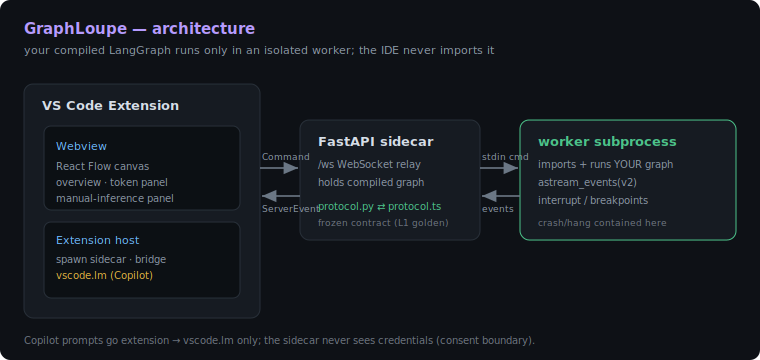
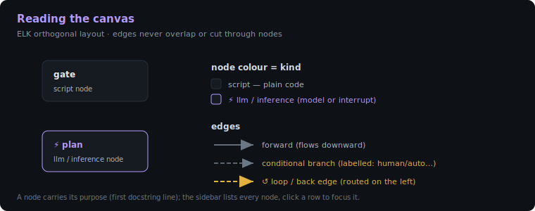
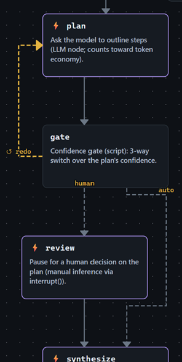
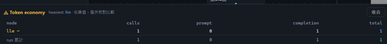
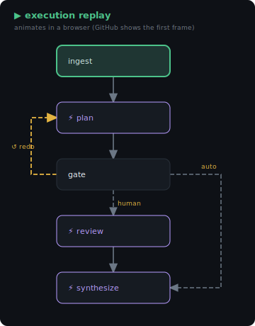
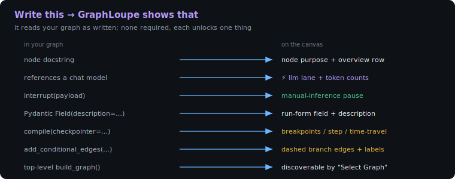
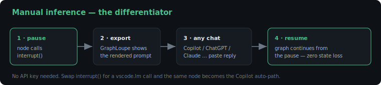
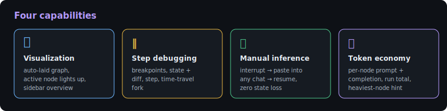
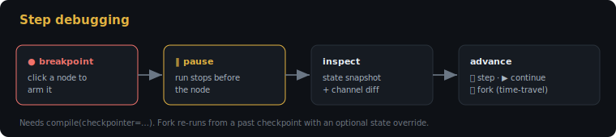

# GraphLoupe

A LangGraph execution-visualization / step-debugging IDE, hosted as a VS Code
Extension with a Python FastAPI sidecar. Point it at a LangGraph graph in your
project and watch it render and run; pause LLM nodes for manual ("paste into any
chat") inference. Design docs live in the monorepo at `workflow/stages/graphloupe/`;
this repo holds the code + this guide.

## At a glance



The IDE never imports your graph. A FastAPI sidecar spawns an **isolated worker**
that imports and runs it; events stream back over a frozen `protocol` contract.



The canvas is auto-laid out (ELK, orthogonal): nodes are coloured by kind
(script vs ⚡ llm/inference), forward edges flow down, conditional branches are
dashed + labelled, and loops route on the left with a ↺.

### The showcase graph, running

| Canvas (showcase: branch + loop + manual + llm) | Token economy after a run |
|---|---|
|  |  |

Open `graphloupe_sidecar.graph:showcase_graph` to see all of it at once
(see [Quick start](#quick-start-the-feature-showcase)).

Its control flow (the active node lights up as it runs — **open this SVG in a
browser to watch it loop**; GitHub shows the first frame):



## Layout

| Path | What |
|------|------|
| `protocol.py` / `protocol.ts` | the single cross-process contract (mirrors; L1 round-trip keeps them in sync) |
| `graphloupe_sidecar/` | Python sidecar — `server.py` (FastAPI `/ws`), `worker.py` (isolated graph runner), `discover.py` (graph scan), `graph.py` (built-in demos) |
| `extension/src/extension.ts` | VS Code extension host — spawns the sidecar, bridges WebSocket ↔ webview, commands |
| `webview/src/` | React + React Flow canvas + manual-inference panel |
| `scripts/quality_gate.py` | L0 (flake8 + mypy + bandit + PIN pytest) + L1 (vitest round-trip) |

## Setup (once)

Needs **Node 18+** and **Python** with the deps in `requirements.lock`.

```bash
npm install
npm run build          # bundles extension + webview into dist/
```

## Quick start (the feature showcase)

1. Open this folder (`apps/GraphLoupe`) in VS Code.
2. Press **F5** → "Run GraphLoupe Extension" (an Extension Development Host opens).
3. In the dev window: **Ctrl/Cmd+Shift+P → "GraphLoupe: Open Graph Panel"**.
4. Set the graph entry to **`graphloupe_sidecar.graph:showcase_graph`** (Select Graph,
   or `graphloupe.graphEntry` in settings) — a graph that exercises *every* feature.
5. You should immediately see (no run needed): two lanes with headers — **⚙ script**
   (`ingest`, `gate`) and **⚡ llm / inference** (`plan`, `review`, `synthesize`) —
   laid out top-to-bottom with arrows, a branch from `gate`, and a left **overview**
   table (click a row to center that node).
6. Click **▶ Run**. Nodes light up; at `review` the **Manual inference** panel opens
   (paste any answer → Send resume); when it finishes the **Token economy** panel
   shows per-node prompt/completion for `plan` and `synthesize`.

> The simpler `graphloupe_sidecar.graph:build_graph` (prepare → llm) and
> `…:manual_demo` are also available if you want a minimal graph.

## Use it on YOUR graph

GraphLoupe runs *your* compiled LangGraph — you never edit `settings.json` by hand.

1. **Open your project folder in VS Code** (it becomes the project root; the picker
   scans it). To point elsewhere, set `graphloupe.projectRoot`.
2. **Ctrl/Cmd+Shift+P → "GraphLoupe: Select Graph"**. It AST-scans your project (no
   code is executed) for a graph factory — a top-level function named
   `build_graph` / `build_app` / `make_graph` / `create_graph`, **or** any function
   that imports langgraph and calls `.compile()`. Pick one.
   - The choice is saved to **your project's** `.vscode/settings.json`
     (`graphloupe.graphEntry`, e.g. `pipeline.graph:build_app`) — per-workspace.
3. **Fill the run-input form** above ▶ Run, then **▶ Run**. GraphLoupe reads your
   graph's input schema (`get_input_jsonschema`) and renders a field per input:
   path-like fields (`repo_path`, `out_dir`, …) get a **Browse…** folder picker,
   others get typed inputs; list/dict fields default to empty. Toggle **JSON** for a
   raw box if you'd rather hand-edit.
4. Edit your graph, then **"GraphLoupe: Reload Graph"** to re-load and re-run.

### Example — a real graph that needs input

Say your project's `pipeline/graph.py` has `def build_app(): ... return g.compile()`
and its first node reads `state["repo_path"]`. After Select Graph picks
`pipeline.graph:build_app`, the form shows `repo_path` and `out_dir` with **Browse…**
buttons and `target` as a text field (lists/dicts like `worklist`/`nodes` default to
empty). Fill them and ▶ Run — no JSON needed. If a node still needs a key you left
blank, the error banner names it (e.g. `run failed: KeyError: 'repo_path'`).

## Make your graph read well in GraphLoupe

GraphLoupe reads your graph **as written** — it never guesses. The more of these
you do, the more it can show. None are required; each unlocks one thing.



| To get this in GraphLoupe | Write this in your graph |
|---|---|
| **Node purpose** (overview table + the line under each node) | A **docstring** on each node function. GraphLoupe shows its first line. |
| **A node in the ⚡ llm / inference lane** | Have the node **reference your chat model** (a `BaseLanguageModel`/`BaseChatModel` it closes over or reads from a global), **or** call **`interrupt()` directly** in the node body. Both are detected at load. Indirect cases (model built in a helper, `interrupt` behind a wrapper) aren't seen statically but are reclassified once observed during a run. |
| **Token economy counts** (prompt / completion per node) | **Invoke a chat model** inside the node. If the model returns `usage_metadata` (real APIs) the counts are exact (`api_usage`); otherwise GraphLoupe falls back to a char-based estimate (`sidecar_estimate`, shown with a `~` and a "relative comparison only" caveat). |
| **Run-input form with field descriptions** | Give the graph a **Pydantic** input/state with `Field(description=…)`; GraphLoupe reads `get_input_jsonschema()` and shows the description under each field. A plain `TypedDict` yields field **names only** (no descriptions). Name path-like fields with `repo`/`dir`/`out`/`path`/`file` to get a **Browse…** picker. |
| **Breakpoints / step / state diff / time-travel** | **`compile(checkpointer=…)`** (e.g. `MemorySaver()`). Without a checkpointer the graph runs to completion but cannot pause. |
| **Manual-inference pause** (export prompt → paste answer → resume) | Call **`interrupt(payload)`** with the contract-shaped payload: `renderedText`, `messages`, `expects` (`"text"`/`"tool_call"`), `toolSchema`, `promptTokens`. See `manual_infer()` in `graphloupe_sidecar/graph.py` for the shape. |
| **Discoverable by "Select Graph"** | Export a **top-level factory** returning a compiled graph, named `build_graph` / `build_app` / `make_graph` / `create_graph` (or any function that imports langgraph and calls `.compile()`). |

`graphloupe_sidecar/graph.py:build_showcase` is a worked example that does all of the
above — read it as the template.

## Manual inference (the differentiator)



If a node pauses with `interrupt()` (a "ManualChatModel"), GraphLoupe turns the run
into: **export the prompt → paste it into any chat (Copilot/ChatGPT/…) → paste the
answer back → resume**, with zero state loss. Try the built-in
`graphloupe_sidecar.graph:manual_demo`:

1. Select Graph → `graphloupe_sidecar.graph:manual_demo` → ▶ Run.
2. The **Manual inference** panel appears with the rendered prompt → **Copy prompt**.
3. Paste it into any chat, get a response, paste it into the panel → **Send resume**.
4. The graph continues from where it paused.

`tool_call` nodes accept a JSON args paste; a bad paste is rejected
(`tool_schema_validation` / `resume_kind_mismatch`) and the run stays paused so you
can fix it.

## Troubleshooting

| Symptom | Meaning / fix |
|---------|---------------|
| "Select Graph" finds nothing | Your factory isn't named build_graph/build_app/… and doesn't call `.compile()` in a file importing langgraph. Rename it, or set `graphloupe.graphEntry` manually. |
| Banner: `graph_load_failed: ...` | The entry couldn't import / has no such callable. The message names the cause. |
| Banner: `run failed: KeyError: 'x'` | Your graph needs input key `x` — fill that field in the run-input form (or the JSON box). |
| `No checkpointer set` (fixed) | A graph compiled without a checkpointer runs to completion but **cannot pause / manual-infer / time-travel** (those need `compile(checkpointer=…)`). |
| Run looks stuck / too long | Set a **breakpoint** (click a node) to pause and step, or use **"GraphLoupe: Reload Graph"** to abort and restart. |
| Canvas is a single lane | No node was classified `llm` — your nodes don't reference a model or call `interrupt()` (e.g. all stubs). That's correct; the second lane appears when a node actually infers. |

## What works today



- ✅ **Graph visualization** — ELK orthogonal auto-layout (edges never overlap or cut
  through nodes), nodes coloured by kind (script vs ⚡ llm), conditional branches
  labelled, loops routed on the left; sidebar overview (click to focus); active node
  highlights.
- ✅ **Step debugging** — breakpoints, state snapshot + diff, step, time-travel fork
  (needs `compile(checkpointer=…)`).
- ✅ **Manual inference** — interrupt → paste → resume (text + tool_call).
- ✅ **Token economy panel** — per-node prompt/completion + run total + heaviest-node
  hint (exact when the model reports usage, else a flagged estimate).
- Copilot auto-path (`vscode.lm`) and a security sandbox for untrusted graphs are
  on the backlog (`workflow/stages/graphloupe/backlog.html`).



## CLI checks (no VS Code needed)

```bash
python pin_dump.py                                   # framework-truth dump (== pin_dump.golden.txt)
python -m graphloupe_sidecar.discover --project-root .  # what "Select Graph" would list
python scripts/quality_gate.py                       # flake8 + mypy + bandit + pytest, then vitest
npm run check                                        # typecheck + vitest + build
```
