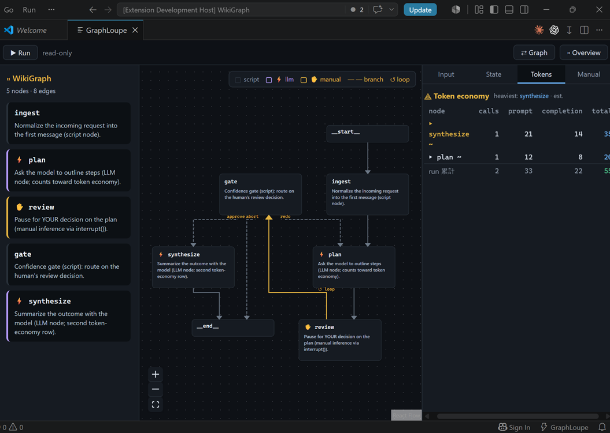

# GraphLoupe — a self-hosted LangGraph debugger for VS Code

**Debug a LangGraph graph at the node level, right in VS Code.** Step through a run,
inspect and diff state between nodes, time-travel from any checkpoint, count tokens per
LLM node — and even pause a node to paste an answer from any chat (Copilot, ChatGPT,
Claude) back in as the model's output. A Python FastAPI sidecar runs your graph in
isolation; **no account, no license, no cloud** — a self-hostable alternative to
LangGraph Studio.

> Built for: *"my agent went down the wrong branch / cost too many tokens / hung on a
> node — how do I see what happened, step by step?"*

📖 **Full documentation → https://bygao.github.io/GraphLoupe/** — getting started, and a
copy-paste snippet for enabling every feature (checkpointer, manual inference, token
economy, run-input form, jump-to-source…).

## What it does

- **Step debugging** — breakpoints on any node, single-step, and time-travel (fork any
  checkpoint and re-run). Needs `compile(checkpointer=…)`.
- **State, three ways** — the **State** tab has **Raw** (current values), **Diff** (the last
  super-step's `before → after` per channel), and **Timeline** (every step's changes across
  the whole run, reconstructed from the checkpoints).
- **Branch decisions** — the **Branch** tab answers *"why did it go there?"*: for each
  conditional edge, the key it chose (`gate → synthesize (approve)`) and the paths it didn't
  take — reconstructed from the committed checkpoint lineage.
- **Run history & comparison** — every run is saved to `.graphloupe/runs.jsonl`; the
  **History** tab lists them, and ticking two shows a **comparison** — first divergence node,
  the branch decisions that differ, and token / latency / status deltas.
- **Manual inference** *(the differentiator)* — a node pauses with `interrupt()`, you copy
  the rendered prompt into any chat, paste the answer back, and the graph resumes with zero
  state loss. Text and `tool_call` both supported.
- **Token economy** — per-node prompt/completion counts + a run total (exact when the model
  reports `usage_metadata`, else a flagged estimate).
- **Visualization** — ELK orthogonal auto-layout, nodes coloured by kind (script vs ⚡ llm),
  conditional branches and loops drawn distinctly, the running node lights up.
- **Jump to source** — click a node's ↗ to open its function in your editor.
- **Health panel** — one glance shows what's wired up (checkpointer, input schema, LLM
  nodes, node source) and what isn't, with the langgraph version and interpreter in use.

The IDE never imports your graph — an isolated sidecar worker does (static AST discovery
never runs your code). 100 % local: the only traffic is a `localhost` WebSocket. No
telemetry, no credentials requested or stored.

## Install

**From the VS Code Marketplace** — search "GraphLoupe" in the Extensions view, or
`code --install-extension byGao.graphloupe`.

**From a `.vsix` (sideload)** — download a release, or build it (`npm install && npm run
package`), then Extensions view → `⋯` → **Install from VSIX…**.

> The sidecar needs **Python with the deps in `requirements.lock`** on the interpreter you
> point GraphLoupe at (the Python extension's selected interpreter, or `graphloupe.pythonPath`).
> GraphLoupe creates its own managed environment for the sidecar and runs *your* graph in
> *your* interpreter — see the [docs](https://bygao.github.io/GraphLoupe/).

## Quick start (2 minutes)

1. Open a folder in VS Code and press **Ctrl/Cmd+Shift+P → "GraphLoupe: Open Graph Panel"**.
2. **"GraphLoupe: Select Graph"** — it AST-scans your project for a graph factory
   (`build_graph` / `build_app` / …) or lets you point at a file + symbol manually. To just
   try it, set the entry to **`graphloupe_sidecar.graph:showcase_graph`** (a built-in graph
   that exercises every feature).
3. **▶ Run.** Nodes light up; at the manual node the **Manual** tab opens with the prompt —
   paste an answer to steer the flow. Set a breakpoint (click a node) to pause in **State**
   (Raw / Diff / Timeline); **Branch** shows which conditional paths it took; **History** lists
   past runs (tick two to compare); **Tokens** shows per-node counts; **Health** shows what's set up.

See the full [getting-started guide](https://bygao.github.io/GraphLoupe/) for connecting
your own graph and enabling each feature.

## GraphLoupe vs LangGraph Studio

Both visualize and run a LangGraph. GraphLoupe trades the polish of the hosted tool for
**node-level depth, a manual-inference escape hatch, and zero-dependency self-hosting**.

| | GraphLoupe | LangGraph Studio |
|---|---|---|
| Where it runs | VS Code extension + local Python sidecar | Desktop/hosted app tied to LangSmith |
| Account / license | **None** (MIT, fully local) | LangSmith account |
| Inspection | **Node-internal** events (`astream_events` v2) | Checkpoint-level |
| Any chat as the model | **Yes** — paste an answer back to resume a paused node | No |
| Per-node token economy | **Yes**, built in | Via LangSmith traces |

*(Positioning as of 2026, not a live feature audit.)*

## Trust & safety

100 % local, no telemetry, no phone-home. No API-key field; manual inference uses *your
own* chat session. Discovery never runs your code (static AST); execution happens in an
isolated sidecar subprocess. Process isolation guards against buggy/runaway graphs, **not
deliberately malicious code** — point it at graphs you'd run yourself. Full threat model in
[SECURITY.md](SECURITY.md).

## Contributing / from source

`npm install && npm run build`, then **F5** ("Run GraphLoupe Extension"). See the
[docs](https://bygao.github.io/GraphLoupe/) for the architecture and dev workflow.
MIT-licensed.
